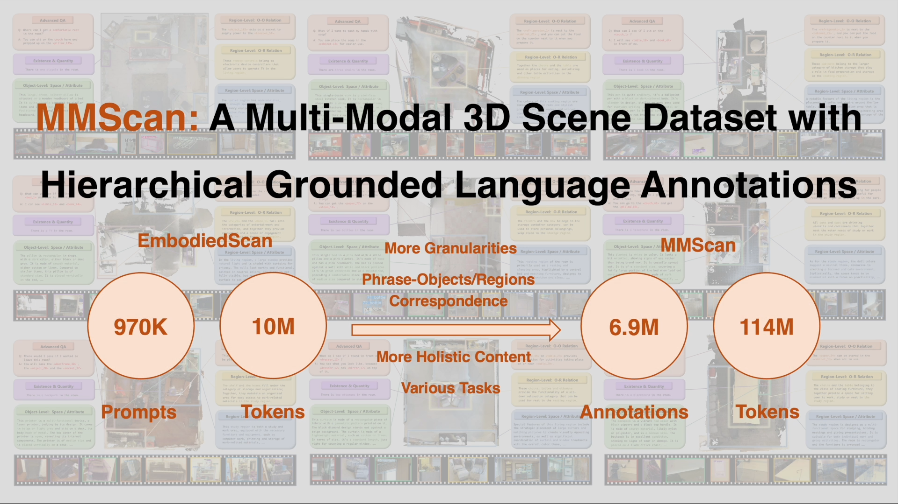

<br>
<p align="center">
<h1 align="center"><strong>MMScan: A Multi-Modal 3D Scene Dataset with Hierarchical Grounded Language Annotations</strong></h1>
  
  </p>
</p>


<div id="top" align="center">

[](https://arxiv.org/abs/2406.09401)
[](./assets/MMScan.pdf)
[](https://tai-wang.github.io/mmscan)

</div>

## 🤖 [Demo](https://tai-wang.github.io/mmscan)


[](https://tai-wang.github.io/mmscan)

<!-- contents with emoji -->

## 📋 Contents

- [🤖 Demo](#-demo)
- [📋 Contents](#-contents)
- [🏠 About](#-about)
- [📚 Getting Started](#-getting-started)
  - [File Structure](#file-structure)
  - [Data Preparation](#data-preparation)
  - [Env Preparation](#env-preparation)
- [📦 Model and Benchmark](#-model-and-benchmark)
- [📝 TODO List](#-todo-list)


## 🏠 About

<!--  -->

<div style="text-align: center;">
    
</div>
     
With the emergence of LLMs and their integration with other data modalities,
 multi-modal 3D perception attracts more attention due to its connectivity to the
 physical world and makes rapid progress. However, limited by existing datasets,
 previous works mainly focus on understanding object properties or inter-object
 spatial relationships in a 3D scene. To tackle this problem, this paper builds <b>the
 first largest ever multi-modal 3D scene dataset and benchmark with hierarchical
 grounded language annotations, MMScan.</b> It is constructed based on a top-down
 logic, from region to object level, from a single target to inter-target relation
ships, covering holistic aspects of spatial and attribute understanding. The overall
 pipeline incorporates powerful VLMs via carefully designed prompts to initialize
 the annotations efficiently and further involve humans’ correction in the loop to
 ensure the annotations are natural, correct, and comprehensive. Built upon exist
ing 3D scanning data, the resulting multi-modal 3D dataset encompasses 1.4M
 meta-annotated captions on 109k objects and 7.7k regions as well as over 3.04M
 diverse samples for 3D visual grounding and question-answering benchmarks. We
 evaluate representative baselines on our benchmarks, analyze their capabilities in
 different aspects, and showcase the key problems to be addressed in the future.
 Furthermore, we use this high-quality dataset to train state-of-the-art 3D visual
 grounding and LLMs and obtain remarkable performance improvement both on
 existing benchmarks and in-the-wild evaluation. 

## 📚 Getting Started

### File Structure

1.  `./data_process` directory demonstrates the data processing steps, including our implementation of GPT extraction and template-based generation. You do not need to run it when using MMScan.

2.  `./VG` directory contains the 3D Visual Grounding benchmark. We have released the code for EmbodiedScan and Scanrefer. Please refer to the README.md within that directory for more information.

3.  `./QA_Caption` directory contains the 3D Question Answering and 3D Caption benchmark, we have released the code for 3D-LLM, LEO and LL3DA. Please refer to the README.md within that directory for more information.

### Data Preparation

 We have cleaned and checked our data in the past month and released several [data samples](https://drive.google.com/file/d/1Y1_LOE35NpsnkneYElvNwuuR6-OAbwPm/view). All the 3D Visual Grounding, 3D Question Answering and 3D Caption samples will be released in a week, and here we first provide some related codes for better understanding our data annotation and processing approaches.

### Env Preparation
The environment settings vary among models. Please refer to the `README.md` file under each model in the `./VG/` and `./QA_Caption/` directories for details.


## 📦 Model and Benchmark

This codebase is a beta version for understanding how we organize the MMScan's data and conduct the training and benchmark process. Next, we provide the guide for different aspects.

MMScan includes benchmarks for **3D Question Answering, 3D Caption, and 3D Visual Grounding**. We provide the codes for **EmbodiedScan (VG), Scanrefer (VG), 3D-LLM (QA & CA), LEO (QA & CA), and LL3DA (QA & CA)** for each respective benchmark. You can find these codes under the `./QA_Caption/` and `./VG/` directories.

1. We implement <b>EmbodiedScan, ScanRefer, BUTD-DETR and ViL3DRef</b>, codebase preliminarily integrates the first 2 models shown below and will include the other two soon
  ```bash
  $ cd ./VG/benchmark/{model_name} # model_name: [EmbodiedScan, Scanrefer]
  ```
2. We implement <b>LEO, 3D-LLM, LL3DA, Chat3D-v2, PointLLM</b>, codebase preliminarily integrates the first 3 models shown below and will include the other two soon
  ```bash
  $ cd ./QA_Caption/benchmark/llmzoo/{model_name} # model_name: [LEO, LL3DA, 3D-LLM]
  ```
## 📝 TODO List

- \[x\] Release the paper and partial codes for datasets.
- \[ \] Release the full MMScan samples
- \[ \] Release the full codes
- \[ \] Full release and further updates.
